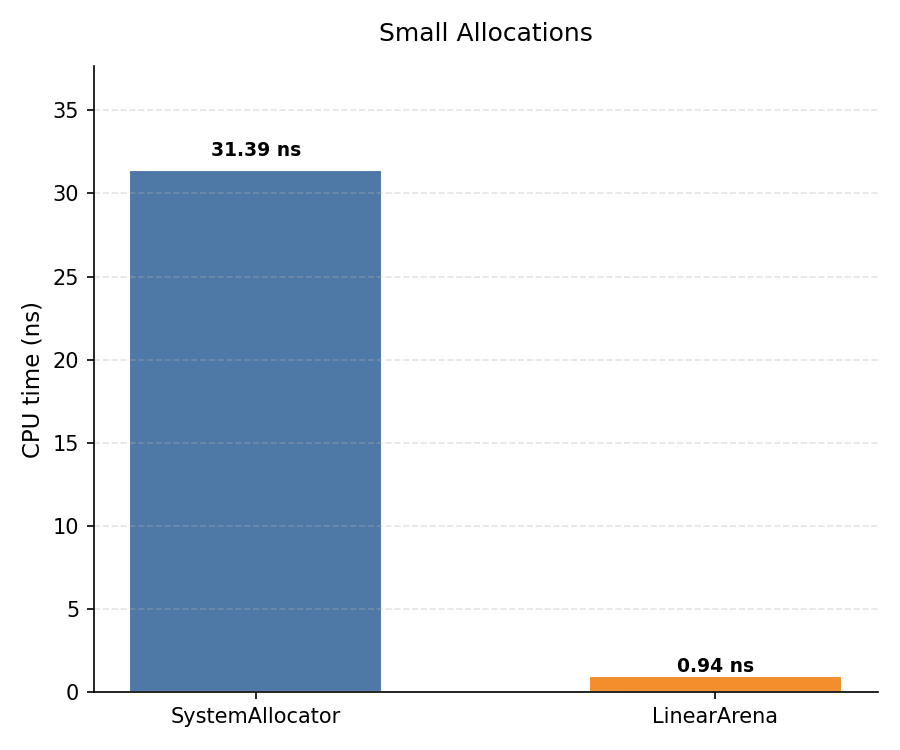

# Benchmarking Various C++ Allocators

## Allocators Implemented
- System Allocator 
- Linear Allocator
- Stack Allocator

## Build Instructions
```bash
mkdir build
cmake -S . -B build -DCMAKE_BUILD_TYPE=Release
cmake --build build
```

## Running Examples
```bash
./build/examples/<EXAMPLE_NAME>
```

## Running Tests

## Benchmarks
### Running Benchmarks
```bash
./build/benchmarks/<BENCHMARK_NAME> --benchmark_format=json --benchmark_out=results.json
```

## Results

### Small allocations 

